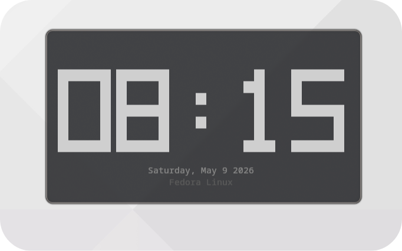

# CLI Clock

<p align="center">
  
</p>

A digital clock for the terminal written in C.

If you find a bug or have an idea, feel free to open an issue or PR 😆

## Prerequisites

To compile this project from source, you need a C compiler and Make installed on your system:

| Component    | Recommended Tools |
|--------------|-------------------|
| Compiler     | `gcc` or `clang`  |
| Build Tool   | `make`            |

These tools are typically found in packages like build-essential, development-tools, or base-devel depending on your distribution.

## Installation

### From source (Recommended)

```bash
git clone https://github.com/MalterxD/CLI-Clock
cd CLI-Clock
chmod +x install.sh
./install.sh
```

The installer auto-detects your package manager, compiles, installs, and configures `~/.clockrc` — including Nerd Font detection.

Or manually:

```bash
make
sudo make install
make setup
```

To uninstall:

```bash
sudo make uninstall
```

### From release

Download the precompiled binary from the [releases page](https://github.com/MalterxD/CLI-Clock/releases):

```bash
tar -xvzf cli-clock-linux-x86_64.tar.gz
./cli-clock
```

## Usage and Arguments

Run the command from anywhere:

```bash
cli-clock              # Default (24h format)
cli-clock -12          # Start in 12-hour format
cli-clock -b           # Enable battery display
cli-clock -s           # Enable large seconds
cli-clock -sc          # Enable screensaver mode
cli-clock -C cyan      # Set digit color by name
cli-clock -C 39        # Set digit color by ANSI 256 code
cli-clock --help       # Show help
```

Flags `-b` and `-s` also accept `on` / `off`:

```bash
cli-clock -b off       # Force battery off even if enabled in config
cli-clock -s on        # Same as -s
```

## Architecture

The code is designed following modularity principles:

- `src/clock.h` / `src/clock.c` — Rendering logic, terminal management (Raw Mode), and UI engine.
- `src/battery.h` / `src/battery.c` — System abstraction to read power supply status from `/sys/class/power_supply/`
    
## Controls

| Key       | Action                  |
|-----------|-------------------------|
| `s`       | Toggle seconds display  |
| `t`       | Toggle 12h / 24h format |
| `b`       | Toggle battery display  |
| `q` / Esc | Exit                    |

## Configuration

Edit `~/.clockrc` to customize color and behavior:

```ini
# ~/.clockrc
color=cyan          # Digit color (name or 0-255)
autocolor=true      # Auto-detect color based on distro
format=24h          # 24h or 12h
show_battery=false  # Show battery status
seconds=false       # Show large seconds
nerdfonts=false     # Use Nerd Font icons for battery display
```

## Distro-based Colors

When `autocolor=true` and no `-C` flag is passed, the clock picks a color based on your distro:

| Distro       | Color  |
|--------------|--------|
| Fedora       | Blue   |
| Arch Linux   | Cyan   |
| Ubuntu       | Orange |
| Debian       | Red    |
| Linux Mint   | Green  |
| Kali Linux   | Blue   |
| Pop!\_OS     | Cyan   |
| Manjaro      | Green  |
| Void Linux   | Olive  |
| openSUSE     | Green  |
  
      Support for more distributions will be added over time.
## Available Colors:
  
`red`, `green`, `blue`, `yellow`, `magenta`, `cyan`, `orange`, `white`, `gray`, `pink`

Or use any ANSI 256 color code directly: `color=214`
